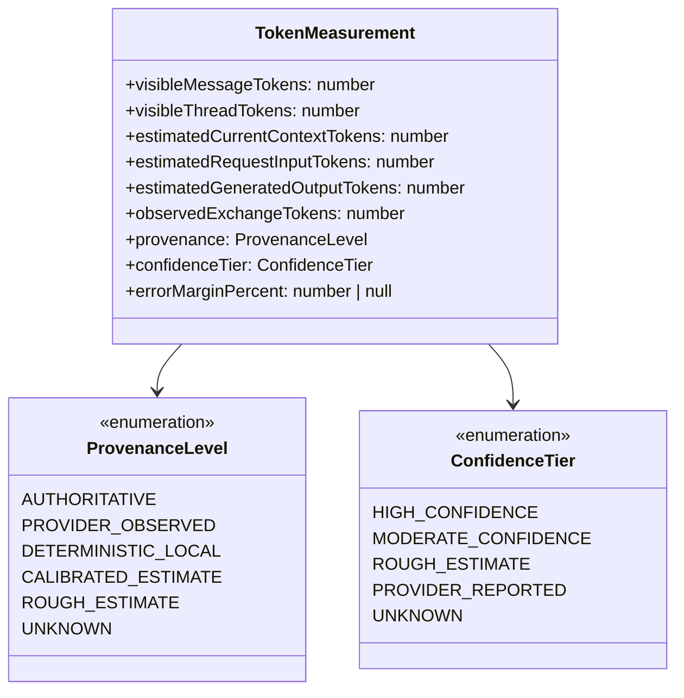
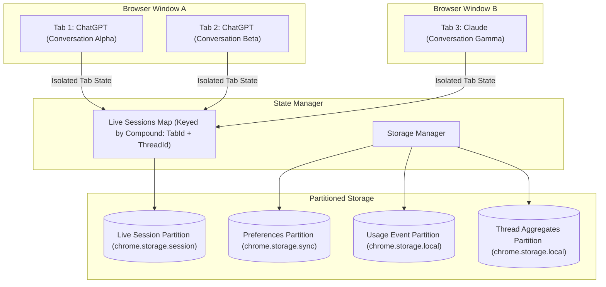
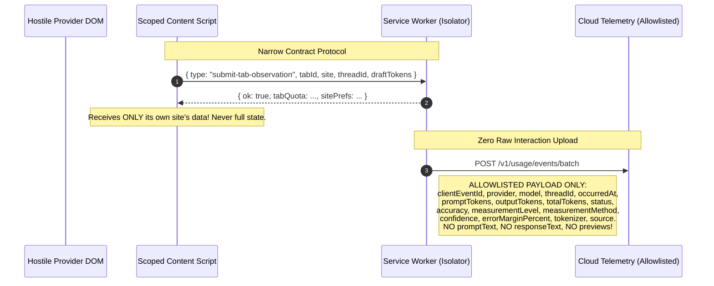
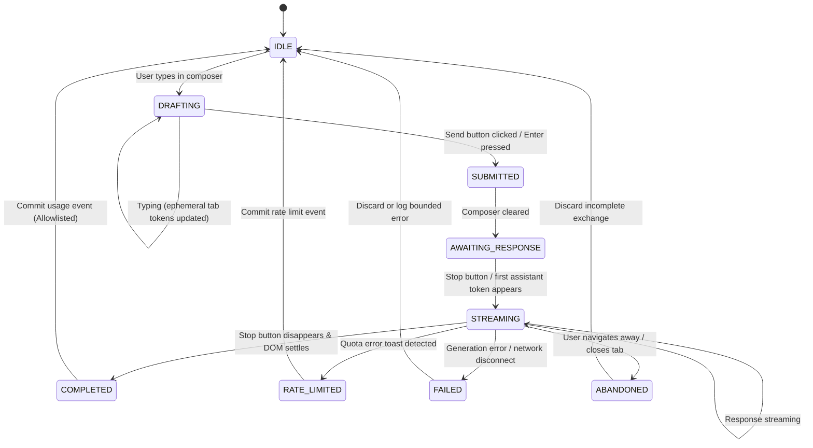

# Target Architecture Specification: Yor Token Usage

**Status**: Target State Specification  
**Version**: 2.0.0-prod  
**Date**: September 13, 2026

---

## 1. Non-Negotiable Product Ontology

The root failure of the prototype was conflating multiple physical realities into ambiguous token and cost numbers. The target architecture establishes non-negotiable domain boundaries:



### Domain Definitions:
1. **`visibleMessageTokens`**: Exact or estimated tokens in a single rendered DOM message node.
2. **`visibleThreadTokens`**: Sum of visible message tokens captured in the active DOM thread.
3. **`estimatedCurrentContextTokens`**: Estimated tokens occupying the model's active attention window (subject to provider context truncation, system prompt, memory, RAG). Labeled strictly as an estimate.
4. **`estimatedRequestInputTokens`**: Estimated tokens in the user's submitted message turn.
5. **`estimatedGeneratedOutputTokens`**: Estimated tokens in the model's completion turn.
6. **`observedExchangeTokens`**: Sum of request input and generated output for a specific turn.
7. **`apiEquivalentCost`**: Hypothetical API proxy pricing. Never represented as actual consumer subscription spend.
8. **`providerQuotaSignal`**: Authoritative signal observed in provider UI/headers (e.g., "5 hours remaining"). Distinct from Yor server quotas.

---

## 2. Multi-Tab Session & State Ownership



### Ownership Rules:
1. **Live Tab Isolation**: Every tab possesses its own session state identified by `tabId` and `threadId`. Tab 1 cannot see or overwrite Tab 2's session.
2. **Tab Closure Cleanup**: When `chrome.tabs.onRemoved` fires, the ephemeral tab session in memory and `sessionStorage` is immediately reclaimed.
3. **Storage Partitioning**:
   - `liveSessions`: Stored ephemerally or in `chrome.storage.session`. Keystroke typing never writes to `chrome.storage.local` or `chrome.storage.sync`.
   - `usageEvents`: Append-only array in `chrome.storage.local`, bounded at 2,500 items. Re-written only on committed turns, not on typing.
   - `preferences`: Written to `chrome.storage.sync` ONLY when preferences mutate (dirty checking).

---

## 3. Strict Least-Privilege Privacy Boundaries



---

## 4. Provider Adapter Specification

Every adapter implements the `ProviderSiteAdapter` interface:

```typescript
export interface ProviderSiteAdapter {
  readonly site: ProviderId;
  readonly label: string;
  matches(url: URL): boolean;
  detectModel(root?: ParentNode): DetectedModelInfo;
  findComposer(root?: ParentNode): HTMLElement | null;
  readComposerText(composer: HTMLElement): string;
  findSendControl(root?: ParentNode): HTMLElement | null;
  findStopControl(root?: ParentNode): HTMLElement | null;
  collectVisibleMessages(root?: ParentNode): CapturedMessage[];
  getConversationId(url: URL, root?: ParentNode): string;
  getQuotaSignals(root?: ParentNode): ObservedQuotaSignal | null;
  getAttachmentDescriptors(root?: ParentNode): AttachmentDescriptor[];
}
```

No heuristic index-parity (`index % 2`) role assignment is permitted. Roles are verified by semantic DOM tags (`data-message-author-role`, semantic article labels) or marked `unknown`.

---

## 5. Capture State Machine



---

## 6. Deterministic Cloud Sync Protocol

- **Cursor-based Resumability**: Follow server pagination using `(occurredAt, id)` composite cursor until `hasMore === false` or safety bound reached.
- **Batch Constraints**: Uploads bounded by `MAX_EVENTS = 100` and `MAX_PAYLOAD_BYTES = 256 KB`.
- **Idempotency**: Client generates UUID v4 `clientEventId`; server deduplicates via PostgreSQL `UNIQUE(user_id, client_event_id)`.
- **Device Binding**: Device-bound routes strictly require and enforce active `x-install-id`. Missing or revoked device IDs fail closed with `401/403`.

---

## 7. Migration & Verification Strategy

1. Fix TypeScript compilation error on HEAD immediately (`c.promptCost`).
2. Revert DB migration `20260913000000_add_interaction_text` and purge raw prompt/response columns from Prisma schema and backend endpoints.
3. Migrate extension architecture from monolithic bundles to modular TypeScript in `src/`.
4. Compile cleanly to `dist/` with reproducible packaging.
5. Validate via end-to-end unit, contract, fixture, browser Playwright, and integration test suites.
