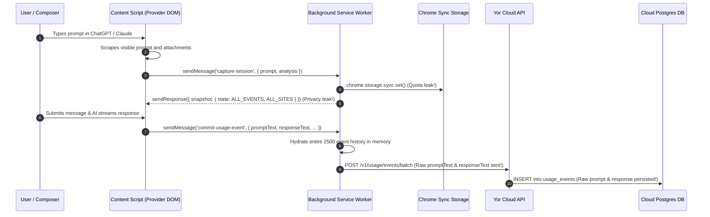

# Forensic Baseline Audit: Yor Token Usage

**Baseline Commit**: `0be48f5362d4e7bb30a6f5c351ee1ed8795c0824`  
**Date**: September 13, 2026  
**Auditor**: Principal Architecture & Security Reviewer

---

## 1. Executive Summary

This forensic baseline establishes the verified defects, architectural bottlenecks, data boundaries, and threat vectors in the repository before the production rebuild. Every finding below was tested and confirmed against the active HEAD commit `0be48f5`.

---

## 2. Inventory of Verified Findings

| ID | Domain | Severity | Finding Status | Concrete Code Location & Mechanism |
|---|---|---|---|---|
| **F-01** | CI / Backend Build | **P0 (Critical)** | **Confirmed** | `backend/src/routes/quota.ts:124, 136, 148` references `c.inputCost` instead of `c.promptCost`, causing `tsc -p tsconfig.json` compilation failure (`TS2339`). `npm run verify` is broken. |
| **F-02** | Privacy / Telemetry | **P0 (Critical)** | **Confirmed** | Commits `1d79b82` and `0be48f5` added `prompt_text` and `response_text` to `UsageEvent` Prisma schema, migration `20260913000000_add_interaction_text`, `usage.ts`, and `service-worker.js`. Raw conversation content is captured and transmitted to the cloud. |
| **F-03** | Privacy / Content Scripts | **P0 (Critical)** | **Confirmed** | `background/service-worker.js:1287` (`buildSnapshot`) returns the full extension state (`state.usageEvents`, `state.sessions`, all threads) in response to `capture-session` and `commit-usage-event`, exposing cross-provider conversation history to provider DOM content scripts. |
| **F-04** | State Architecture | **P0 (Critical)** | **Confirmed** | `background/service-worker.js:989` keys `state.sessions` strictly by provider key (`chatgpt`, `claude`, etc.). Two tabs on the same provider clobber each other's live session state. |
| **F-05** | Storage / Chrome Sync Quotas | **P0 (Critical)** | **Confirmed** | `background/service-worker.js:1144` (`writeStateToStorage`) calls `sync.set()` or `sync.remove()` on every session mutation and keystroke debounce. Furthermore, it serializes the entire 2,500 event history on every write. |
| **F-06** | Device Security | **P1 (High)** | **Confirmed** | `backend/src/services/devices.ts:134` (`verifyDeviceNotRevoked`) returns early without error when `x-install-id` header is omitted, failing open for revoked clients that simply strip the header. |
| **F-07** | Cloud Sync Pagination | **P1 (High)** | **Confirmed** | `background/service-worker.js:1750` requests `/v1/sync/state` once with `maxEvents: 500` and ignores `hasMore` and `nextCursor`, meaning events beyond page 1 are permanently un-synchronized. |
| **F-08** | Token Ontology & Output Oracle | **P1 (High)** | **Confirmed** | `content/accuracy-engine.js:136` (`estimateOutputTokensFromPrompt`) uses arbitrary keyword boosts (+300 for "in detail", etc.) to invent speculative output tokens. `totalTokens` ambiguously represents multiple concepts. |
| **F-09** | Attachments & Fake Confidence | **P1 (High)** | **Confirmed** | `content/accuracy-engine.js:129` calculates `attachment.sizeBytes / 4` as universal tokens, and line 169 calculates confidence via `0.42 + safeAdapterConfidence * 0.18`, displaying manufactured numerical precision. |
| **F-10** | Prompt Optimizer Safety | **P1 (High)** | **Confirmed** | `content/index.js:668` strips meaningful words ("just", "please", "kindly") globally with regexes, silently caps constraints (`slice(0, constraintLimit)`), and provides no diff or undo before replacing composer drafts. |
| **F-11** | Model Registry & Pricing | **P1 (High)** | **Confirmed** | `backend/src/services/pricing.ts:317` silently falls back to `gpt-4o`, `claude-sonnet`, or `gemini-2.5-flash` for any unknown model, fabricating costs instead of returning unknown. Model registry is duplicated between backend and frontend. |
| **F-12** | Source Architecture | **P1 (High)** | **Confirmed** | Root extension files (`content/index.js`, `background/service-worker.js`) are 75KB-95KB monolithic bundles checked in as source with pseudo-module comments (`// src/adapters/...`). No TypeScript compiler or clean build step exists for the extension. |
| **F-13** | Redis Streams | **P1 (High)** | **Confirmed** | `backend/src/jobs/usageWorker.ts:53, 74` writes to `usage-events` and `usage-events:dead` without `MAXLEN ~` stream trimming, creating unbounded memory growth. |
| **F-14** | Phantom / Dead Backend Code | **P2 (Medium)** | **Confirmed** | Unused `UserSecret` model, dead `/v1/settings` endpoints (never called by the extension), and vestigial Stripe billing types with no actual payment pipeline. |

---

## 3. Dependency & Source Architecture Map

```mermaid
graph TD
  subgraph Extension Monolith [Current Prototype State]
    ContentBundle["content/index.js (95 KB monolithic)"]
    SWBundle["background/service-worker.js (76 KB monolithic)"]
    AccuracyBundle["content/accuracy-engine.js (7.9 KB)"]
    PopupBundle["popup/index.js (17 KB)"]
    DashboardBundle["dashboard/index.js (18 KB)"]
    SettingsBundle["settings/index.js (21 KB)"]
  end

  subgraph Shared Chrome Storage [Storage Contention]
    LocalArea["chrome.storage.local (STATE_KEY: all 2500 events)"]
    SyncArea["chrome.storage.sync (overwritten every keystroke)"]
    SessionArea["chrome.storage.session (auth token)"]
  end

  ContentBundle -->|capture-session / commit-usage-event| SWBundle
  SWBundle -->|Full State Leakage in Snapshot| ContentBundle
  SWBundle --> LocalArea
  SWBundle --> SyncArea
  SWBundle --> SessionArea

  subgraph Backend Service [Fastify + Prisma + Redis]
    FastifyApp["Fastify API Server"]
    UsageRoute["POST /v1/usage/events/batch"]
    SyncRoute["POST /v1/sync/state"]
    QuotaRoute["GET /v1/quota/check (Broken TS on HEAD)"]
    RedisQueue["Redis Stream: usage-events (Unbounded)"]
    Worker["Usage Worker (Single Attempt Model)"]
    PostgresDB[(PostgreSQL Database)]
  end

  SWBundle -->|HTTP Batch Upload (Leaking Prompts)| UsageRoute
  SWBundle -->|HTTP Sync (1-page only)| SyncRoute
  UsageRoute --> RedisQueue
  RedisQueue --> Worker
  Worker --> PostgresDB
```

---

## 4. Sensitive Data Flow Analysis



### Critical Boundaries Identified:
1. **Provider DOM vs Content Script**: The provider DOM is untrusted and hostile. Any data passed back into the content script must be strictly scoped to the active provider and thread.
2. **Content Script vs Service Worker**: Message contracts must be minimum-privilege (`submit-observation`, `get-tab-view-state`). Never return global state.
3. **Client vs Cloud Telemetry**: Raw user prompt text, response text, draft text, and unapproved metadata must NEVER enter cloud batch payloads. Strict compile-time and runtime allowlists are mandatory.

---

## 5. Summary of Obsolete vs Confirmed Assumptions

- **Obsolete**: The assumption that `verify.yml` passes on main (disproved: backend TypeScript compilation fails on current HEAD).
- **Obsolete**: The assumption that `npm run verify` was running strict typechecking on extension files (disproved: extension has no tsconfig or compile step; checks were limited to `node --check` syntax check).
- **Confirmed**: All 14 audit findings in the prompt are verified against concrete lines of code.

This baseline forms the concrete target for Phase 2: Target Architecture Specification.
